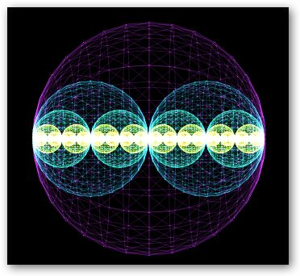

# The Revolution of the Electroatomic Model
The content of this post provides a review of the evolution of atomic models throughout history and highlights the importance of constructing a “Periodic System” (PS) of electroatoms instead of the current Rutherford-Bohr planetary model. In this new approach, a unique “electroatom” is the indivisible elementary particle, and the periodic system is constructed based on the volumetric electric density of the electroatoms. The content also emphasizes that electricity and electric matter should be considered as a self-organized and discrete electric substance, rather than separate particles.

In summary, the current Rutherford-Bohr model and other atomic models are insufficient, and a new Periodic System of electroatoms should be built for a more precise and comprehensive understanding of electric nature. The proposed approach promises to provide a unified field theory that corresponds to reality and is not based on unverifiable assumptions or conjectures.

# Introduction
Throughout the history of science, the model of the atom has undergone various modifications and proposals. From the early attempts to understand the structure of atoms in the 19th century to the more modern models based on quantum mechanics, scientists have sought precision and deep understanding of the smallest particle of matter.

In this article, we will explore a revolutionary view of the electroatomic model based on the RUS (Stable Equivalent) Periodic System, an approach that relies on the self-taught distribution of electroatoms in periods (homogeneous) and rows (heterogeneous), and proposes a distinct interpretation of electricity and elementary particles.

# Origin of Atomic Models
From the 19th century to the early 20th century, different scientists proposed models to describe the structure of atoms. In 1902, J.J. Thomson presented a model in which positive charge was uniformly distributed throughout the atom, and electrons “floated” within this sphere. On the other hand, F. Lenard suggested that there were no separate electrons and positive charges in the atom.

In 1904, H. Nagaoka proposed the atomic model of rings of negative electrons around a positively charged center of attraction. Then, in 1912, E. Rutherford used the term “nucleus” for the first time, and the Rutherford-Bohr planetary model was established, which is now taught in most textbooks.

# Jean Perrin’s Molecular Hypotheses
However, it is interesting to note that in 1901, the French scientist Jean Perrin, not Rutherford, proposed a hypothesis in which a positively charged nucleus was surrounded by negative electrons moving in certain orbits. This idea, expressed in his article “Molecular Hypotheses,” presented an atomic structure similar to what is taught today.

# Charge Conventions and the Electron
It is noteworthy that the conventions “+” and “-” in electricity were introduced by B. Franklin in the 18th century, but the electron, considered a fundamental negative charge, was never discovered as such. J. Thomson simply suggested the existence of a “certain particle” with a negative sign while studying X-rays.

# The RUS Electroatomic Model
The RUS electroatomic model, developed based on the RUS Periodic System, presents a radically different conception of atoms and electricity. In this approach, electroatoms are considered the smallest elementary particles of matter and have no internal structure.

The RUS Periodic System is constructed through a periodic dependence on the volumetric electric density of electroatoms, organized according to a binary counting system. Each subsequent electroatom in the period contains the previous one and differs from it in its structure, determining the change in its properties in the period. This model seeks a true “Unified Field Theory” that corresponds to the realities of nature at all levels of knowledge.

# The RUS Periodic System and Discrepancies in the PS
One of the main criticisms of the classical PS (Periodic System) model is the arrangement of atoms according to atomic weights, which does not withstand certain criticisms. For example, in the second period, discrepancies between theory and reality appear under normal conditions, where the elements Li, Be, B, C, N, O, F, Ne are lighter than the gases that follow them.

The error in the arrangement of atoms in the 1869 PS and 1906 PS according to the Avogadro-Gerard law, which determined the relationship between the number of atoms and molecules, has been one of the obstacles to understanding electric nature.

# The Self-Organized Electric Substance
The RUS electroatomic model proposes that electricity cannot be divided into separate elementary particles and that electric matter is a self-organized and discrete electric substance. Furthermore, it suggests that differences in the properties of electroatoms are due to the organization of their electric structure and not the quantity of elementary particles.

# Conclusions
The RUS electroatomic model offers a revolutionary perspective on the structure of matter and electricity, presenting an interpretation that seeks a unified field theory closer to the realities of nature. While the Rutherford-Bohr model has been fundamental in the historical understanding of the atom, the RUS approach invites us to reconsider and question our current conceptions.

As science continues to advance, it is essential to keep an open mind and be willing to embrace new paradigms that may emerge, allowing us to approach a deeper understanding of the intimate structure of reality. The RUS electroatomic model shows us that there is still much to discover and explore in the fascinating world of science.

Here is the complete list of atomic forms: https://electroatom.github.io/en/
.

Raúl Peláez © 2023 All rights reserved.

...
